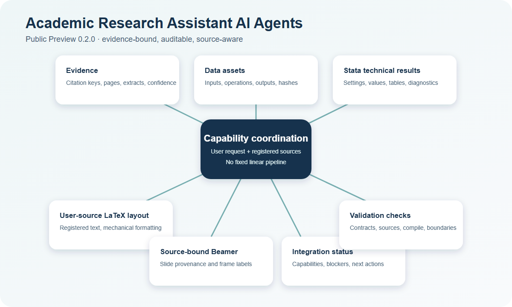

# 学术研究辅助 AI Agents Public Preview

English name: **Academic Research Assistant AI Agents — Public Preview**

这是完整 private 产品的受控公开预览，版本为 `0.2.0`。它展示能力边界、公开契约记录和一个极小的证据约束型 Beamer 演示，但不包含完整 agent 指令、skills、协调实现、数据处理脚本、Stata 工作流或 private 模板库。

## 七项研究辅助能力

| 能力 | 可审计产物 |
| --- | --- |
| `Subagent_evidence` | 证据卡、引用键、页码和置信度 |
| `Subagent_process_data` | 清理后的数据资产与构建记录 |
| `Subagent_regress_stata` | 模型设定、数值、表图和诊断 |
| `Subagent_format_latex` | 用户原文排版与来源哈希 |
| `Subagent_presentation` | 有来源约束的 Beamer 演示 |
| `Subagent_integrate` | 按请求组织的能力状态与阻塞项 |
| `Subagent_check` | 路径、契约、来源和编译检查 |

## 学术诚信边界

- 证据记录必须绑定来源、页码或用户材料。
- 数据模块只交付数据资产、模型设定、数值、表图、诊断和运行元数据。
- 长文档只排版 manifest 中登记的用户原文，不补充措辞或研究主张。
- 演示只允许 `verbatim`、`extract`、`compress`、`layout` 四种有来源变换。
- 缺少用户材料或证据资产时暂停，并明确报告阻塞项。

详情见 [能力与边界](docs/capabilities-and-boundaries.md) 和 [架构预览](docs/architecture.md)。

## 极小可运行演示

环境要求：Node.js 20+；渲染还需要 XeLaTeX、latexmk，PNG 导出需要 Poppler。

```powershell
npm run check:terminology
npm run demo:check
npm run demo:render
npm run demo:render:png
```

演示只使用 synthetic brief。每个 frame 都通过 `slide:<id>` 与 manifest 中的来源记录对应。详见 [Demo 说明](docs/demo-walkthrough.md)。



## Private 与 Public Preview

| Public Preview | Private 产品 |
| --- | --- |
| 产品说明与安全边界 | 七个完整 subagent |
| 静态 synthetic 契约记录 | 完整 contracts、scripts 与 skills |
| 一个极小 Beamer 演示 | 完整证据、数据、Stata、排版、演示、协调与检查能力 |
| public-only 极简模板 | private 可复用模板与完整检查流程 |

完整 private 产品不是开源发布。申请方式见 [BUY.md](BUY.md)，常见问题见 [FAQ.md](FAQ.md)。
