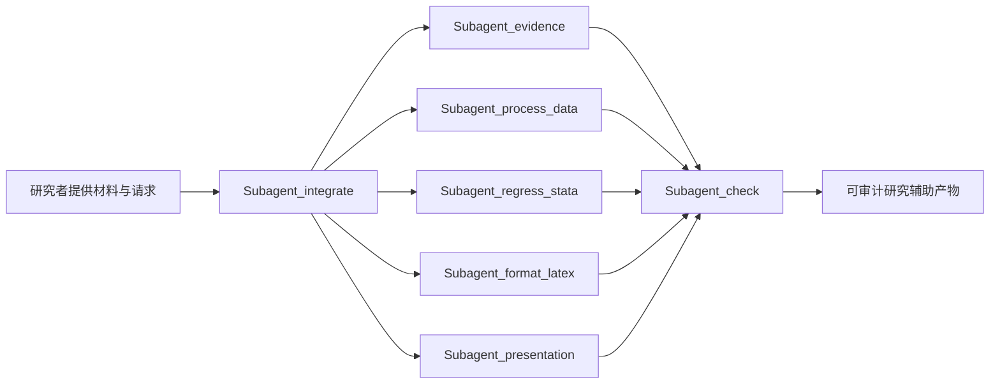

# 架构预览

private 产品由七个根级 subagent 组成，协调器只调用用户请求所需的能力，不假定固定线性流程。

## 公共契约层

- evidence：来源、引用键、页码、摘录和置信度；
- data：输入资产、清理步骤、输出资产和哈希；
- regression：软件版本、模型设定、数值、诊断和产物路径；
- formatting：用户源文件、源哈希、机械转换方式和目标路径；
- presentation：来源、slide、frame label 和允许的变换；
- integration：请求能力、关联 case、状态、阻塞项和下一动作；
- check：路径、契约、来源、编译和边界检查结果。

public preview 只提供这些接口的 synthetic 记录。private 产品才包含完整执行规则和内部实现。
