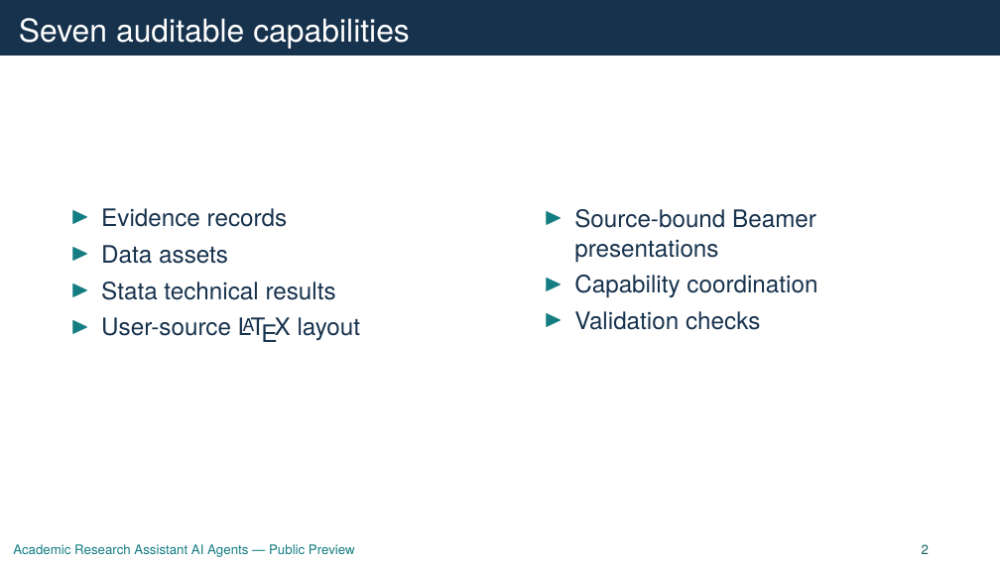

# 极小 Beamer 演示

演示路径：`examples/example_research/example_presentation/`

## 文件关系

```text
inputs/brief.md
  -> manifests/presentation_manifest.json
  -> source/main.tex
  -> outputs/pdf/example_presentation.pdf
  -> outputs/png/slide.001.png ...
```

`brief.md` 是唯一用户材料。manifest 为每个 slide 登记来源和变换类型，Beamer 源码中的 frame 通过 `slide:<id>` 对应 manifest。

## 运行

```powershell
npm run demo:check
npm run demo:render
npm run demo:render:png
```

`demo:check` 不需要 TeX 环境。`demo:render` 需要 XeLaTeX 和 latexmk；PNG 导出还需要 `pdftoppm`。

所有运行产物进入 ignored `outputs/`。公开仓库只保留预先检查过的展示 PNG，不提交 PDF、日志或构建目录。


